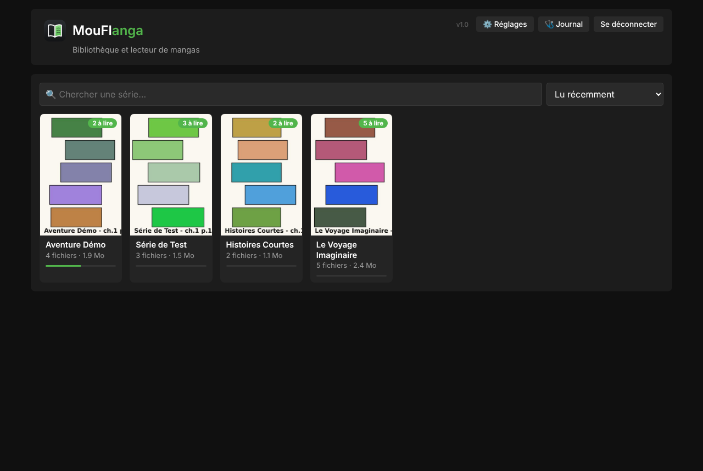
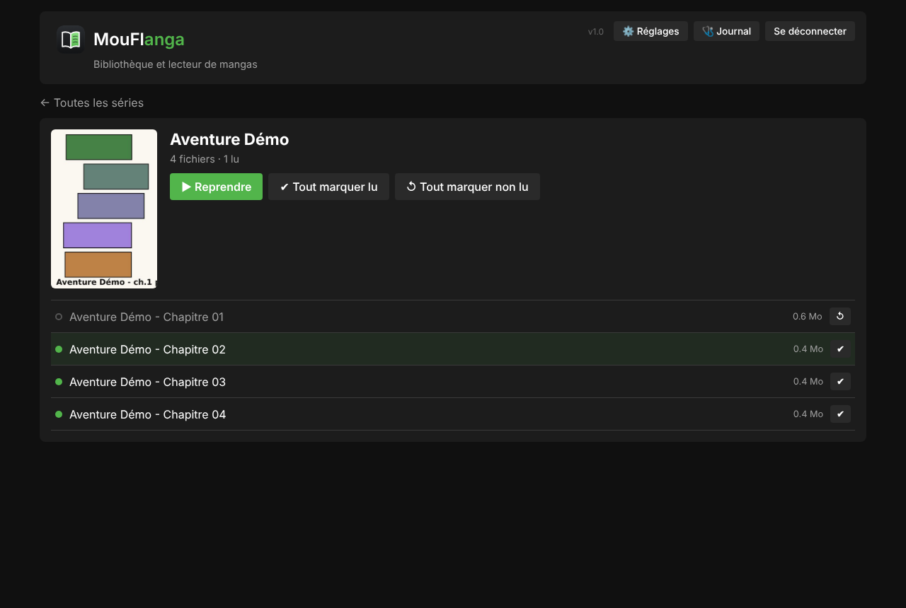
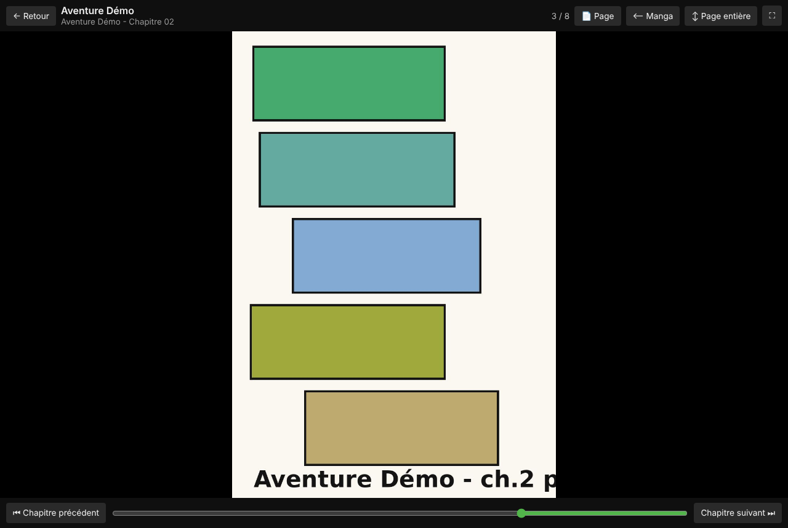
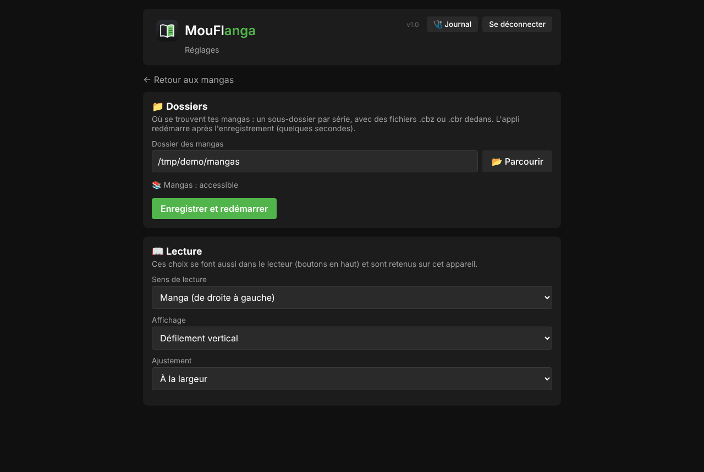
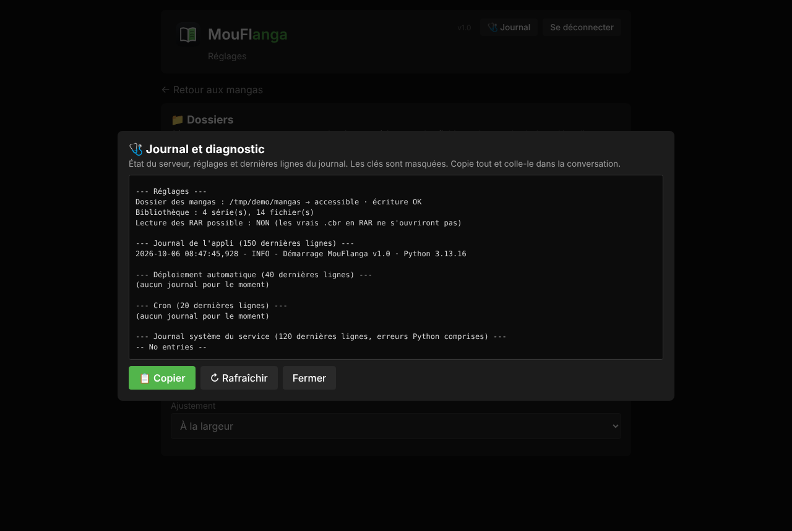
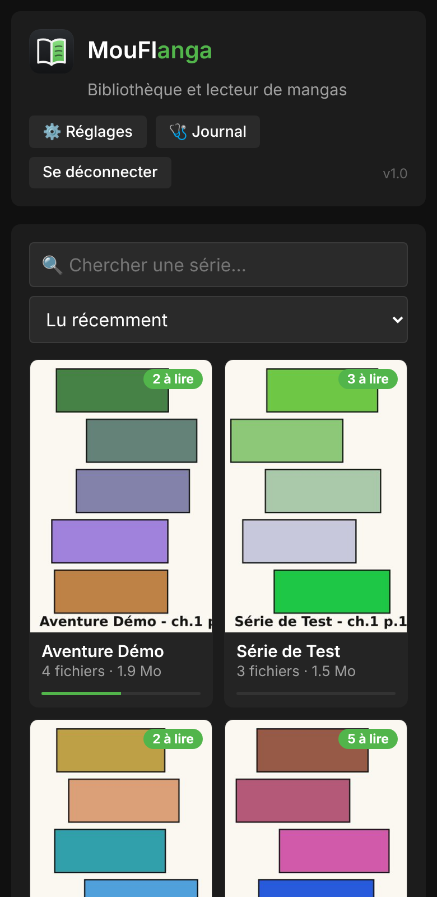

# 📚 MouFlanga · bibliothèque et lecteur de mangas

[](LICENSE)
[](https://www.python.org/downloads/)

Application web pour **ranger et lire tes mangas et BD** (fichiers `.cbz` et `.cbr`) depuis ton serveur, sur ordinateur comme sur téléphone. Elle fait partie de la suite MouFl, avec MouFlanimeXer, MouFloster et MouFlopening : même style, même page ⚙️ Réglages, même connexion, même Journal de diagnostic.

Pour installer l'appli sur le serveur et la remettre en route après une panne, voir [`INSTALL.md`](INSTALL.md).

## 📸 Aperçu

*Captures avec des données de démonstration.*

**La bibliothèque : une couverture par série, avec le nombre de chapitres à lire**



**Une série : chapitres lus ou non, bouton « Reprendre »**



**Le lecteur : une page à la fois, sens manga, barre de progression**



**La page ⚙️ Réglages : dossier des mangas et préférences de lecture**



**La fenêtre « Journal » pour comprendre une panne**



**Sur téléphone**



## ✨ Ce que fait l'appli

- 📚 **Bibliothèque automatique** : chaque sous-dossier du dossier des mangas est une série, chaque fichier `.cbz` / `.cbr` (ou `.zip` / `.rar`) est un chapitre ou un tome
- 🖼️ **Couvertures** : première page du premier chapitre, ou une image `cover.jpg` posée dans le dossier de la série
- 🔍 **Recherche et tri** : par titre, lecture récente, ajout récent, nombre de chapitres restant à lire
- 📖 **Lecteur intégré** : une page à la fois ou défilement vertical, sens manga (droite → gauche) ou occidental, page entière ou largeur, plein écran
- ⌨️ **Commandes** : flèches du clavier, espace, touches Début / Fin, clic sur le côté gauche ou droit de l'image (ou toucher sur téléphone), touche `H` pour masquer les barres
- ⏭️ **Chapitre suivant automatique** en arrivant à la fin, avec reprise exactement à la page où tu t'étais arrêté
- ✔️ **Suivi de lecture** enregistré sur le serveur : chapitres lus, « Tout marquer lu / non lu »
- 🔒 **Connexion** par identifiant et mot de passe (le mot de passe n'est jamais stocké en clair)
- 🩺 **Journal** : un rapport complet à copier-coller pour comprendre un problème, sans se connecter au serveur
- ⚙️ **Réglages** : dossier des mangas (avec un explorateur de dossiers) et préférences de lecture
- 🔄 **Mise à jour automatique** : le serveur vérifie GitHub chaque minute et se met à jour tout seul

## 📁 Comment ranger les fichiers

```
Manga/
├── Ma série A/
│   ├── Ma série A - Tome 01.cbz
│   └── Ma série A - Tome 02.cbz
├── Ma série B/
│   ├── Chapitre 001.cbr
│   └── Chapitre 002.cbr
└── Un fichier seul.cbz        → rangé dans « (Sans série) »
```

Les pages des fichiers sont triées « comme un humain » (1, 2, 10 et non 1, 10, 2). Beaucoup de fichiers `.cbr` sont en réalité des ZIP : l'appli regarde le contenu du fichier, pas seulement son extension. Les vrais fichiers RAR demandent en plus un petit outil de décompression sur le serveur (installé automatiquement si possible, sinon le Journal l'explique).

## 🚀 Installation rapide

Sur le serveur, en `root` :

```bash
cd /opt
git clone https://github.com/mouflo/MouFlanga.git mouflanga
bash /opt/mouflanga/install.sh
bash /opt/mouflanga/set-login.sh
```

Puis ouvre `http://IP-DU-SERVEUR:5002`, va dans ⚙️ Réglages et choisis ton dossier de mangas. Les détails sont dans [`INSTALL.md`](INSTALL.md).

## 🔐 Sécurité

- L'identifiant et le mot de passe (haché) sont dans `data/secrets.env`, qui n'est **jamais** envoyé sur GitHub
- Aucune clé ni mot de passe dans le code ni dans l'historique du dépôt
- Les fichiers ne sont lus que **dans** le dossier des mangas configuré : un chemin piégé (`../`, lien symbolique vers l'extérieur) est refusé
- L'appli ne modifie, ne déplace et ne supprime aucun de tes fichiers : elle les lit seulement

## 🧪 Tests

```bash
python3 -m unittest discover -s tests
```

## 📄 Licence

MIT, voir [`LICENSE`](LICENSE).
